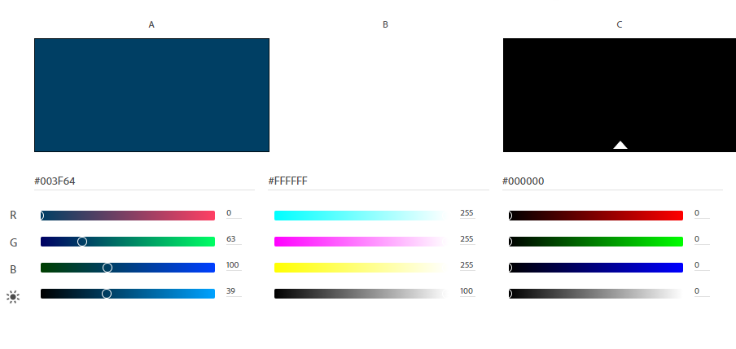
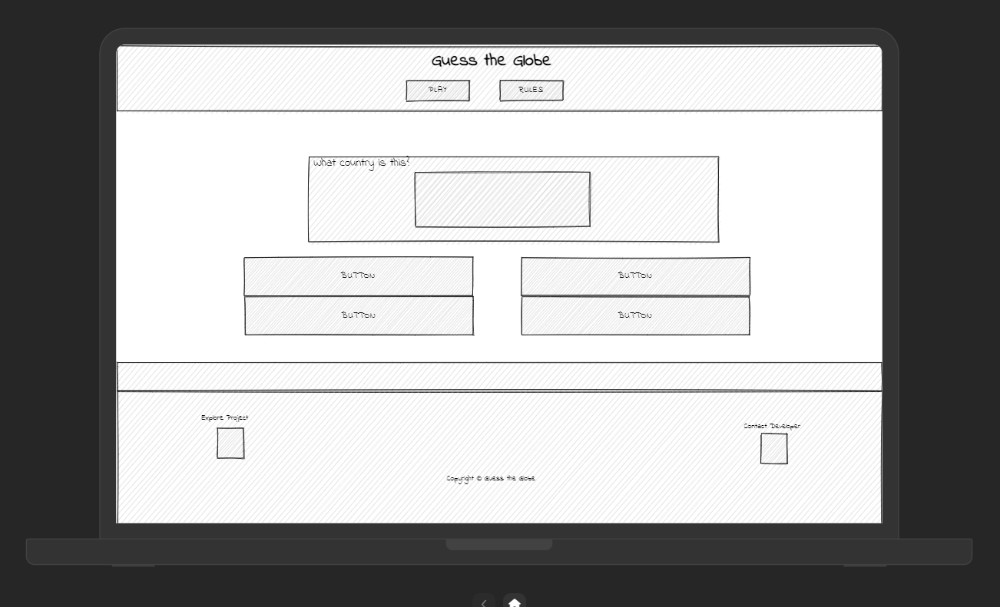
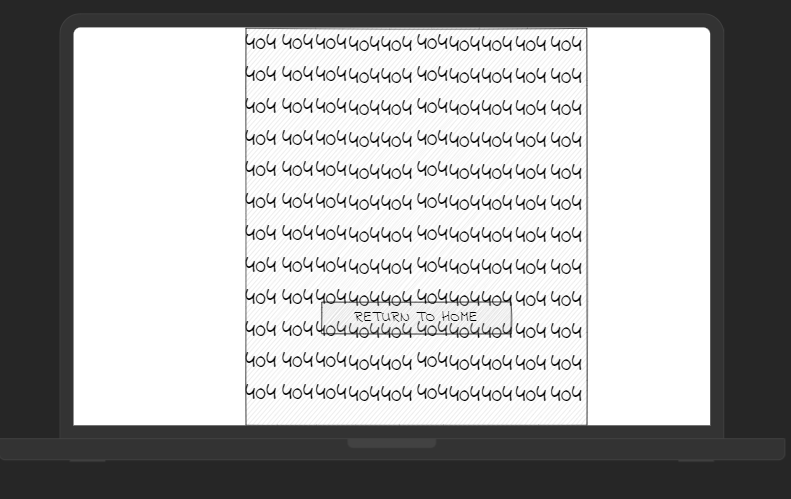
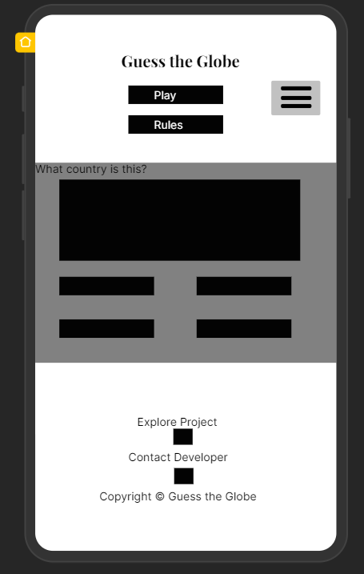
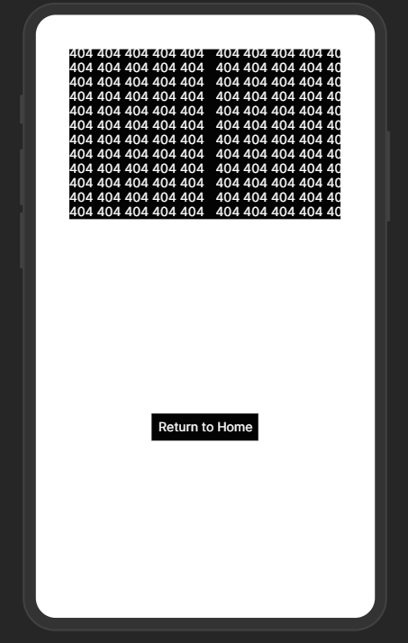
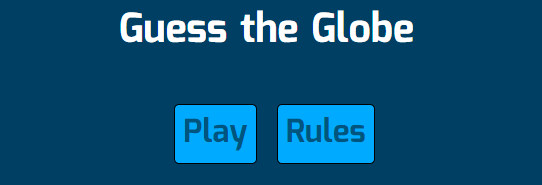
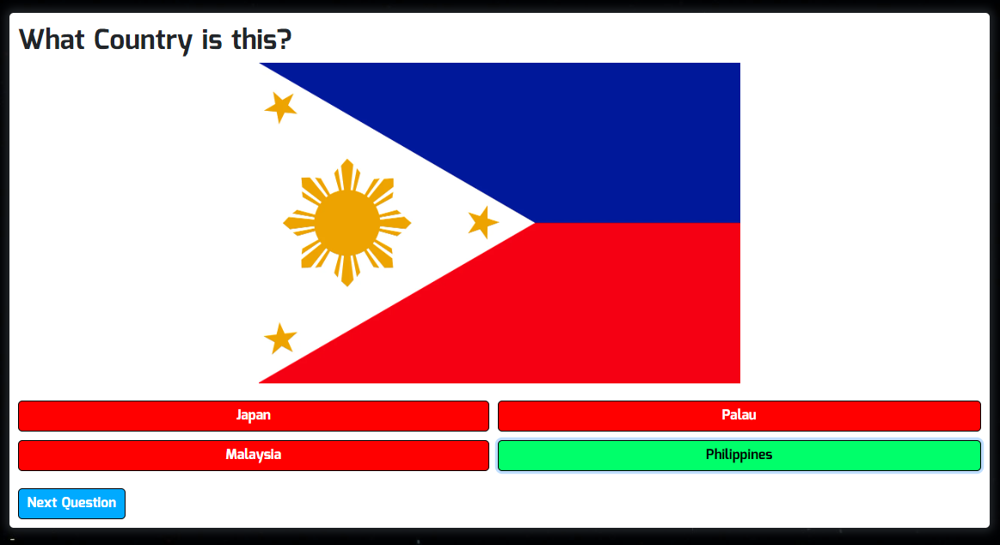
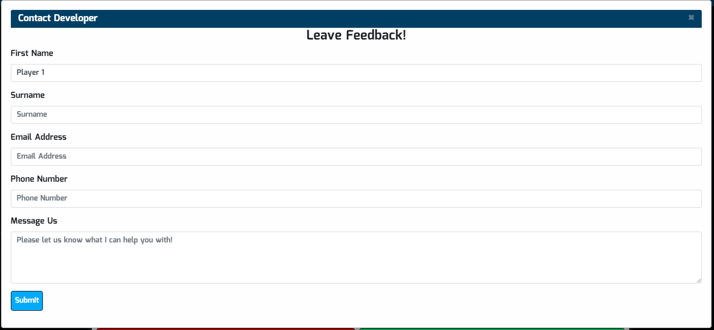

# Guess the Globe
(Developer: Keith Bautista)

[Live Website](https://keithbautista.github.io/guess-the-globe/index.html)

## Table of Contents
1. [Project Goals](#project-goals)
    1. [User Goals](#user-goals)
    2. [Site Owner Goals](#site-owner-goals)

2. [User Experience](#user-experience)
    1. [Target Audience](#target-audience)
    2. [User Requirements](#user-requirement)

3. [User Stories](#user-stories)
    1. [First Time User](#first-time-user)
    2. [Returning User](#returning-user)
    3. [Site Owner](#site-owner)

4. [Design Decisions](#design-decisions)
    1. [Design Choices](#design-choices)
    2. [Color](#color)
    3. [Fonts](#fonts)

5. [Structure of Pages](#structure-of-pages)

6. [Wireframes](#wireframes)

7. [Technologies Used During Creation](#technologies-used-during-creation)

8. [Frameworks & Tools](#frameworks-&-tools)

9. [Features](#features)
    1. [Menu and Menu Tabs](#menu-and-menu-tabs)
    2. [Images](#Images)
    3. [Contact Us](#contact-us)
    4. [Footer](#footer)
    5. [Progress-Bar]
    5. [404 Error](#404-error-page)

## Project Goals

### User Goals

- Ability to be able to find a quiz game.
- Ability to find a quiz game that provides its content in a clear and consise manner.
- Ability to contact the developer whom created the site.

### Site Owner Goals

- Provide a fun and exciting game that includes pictures.
- Ability for users to be able to contact with me.
- Provide an easy and simple way to see progress through a synamic progress bar.

## User Experience

### Target Audience

- People who are looking for a fun and quick game.
- People whom are interested in flags and countries

### User Requirements

- A website which is intuitive and is simple to navigate around.
- Easily find information within a couple clicks such as rules and contact information.
- Links and Buttons works as expected.
- Ability to easily get in contact with Business through the site.
- Easily access through different forms of interaction (Mobile and Desktop).

## User Stories

#### First Time User

1. As a first time user I would like to see a simple layout that is easily navigatable.
2. As a first time user I would like to know how the game works.
3. As a first time user I would like to know my current progress through the questions.

#### Returning User

4. I want to be able to play the game on any device that I choose, especially my phone.
5. I want to play the game with friends and family to compare knowledge on flags and countries.

#### Site Owner

6. As the site owner I want users to enjoy the game I have created.
7. As the site owner I want users to have the ability to get in contact with me in case further oportunities arise.
8. As the site owner I want the users to be able to easily access the site and know their current progress through the questions.

## Design Decisions

### Design Choices

This website was created with the idea of space or up in the athmosphere as those are the only times where you are able to see countries as a whole. The hope is to provide a website that is easily accessible.

### Color

For color I have kept it simple with the major colors being a dark shade of blue (#003f64) with aspects of white and black as the majority of the font colors. 

### Fonts 

Mina with from Google Fonts was used for the majority of this project with a fall back of sans serif. Mina was specifically chosen as it slightly imitated characters that you you associate with space and flight.

## Structure of Pages

There are only two html files that this project consists of, index.html as well as the 404.html page.

- index.html: This is only a one page site whereby the rest of the content is hidden in modals. Content such as the rules as well as the contact form.
- 404.html: This is the only other page apart from the index.html. This page consists of an image with 404 written accross it as well as a button below it to be able to return back to the index.html page.

## Wireframes

Index.html Web

404.html Web

Index.html Phone

404.html Phone

## Technologies Used During Creation

- HTML
- CSS
- JavaScript

## Frameworks & Tools
- Bootstrap v4.6
- Git
- Github
- uizard (wireframes)
- Google Fonts
- Adobe Color
- Font Awesome
- Favicon.io
- Unsplash
- Pexels
- Pixabay
- imagecompressor (Compressing Images)
- cloudconvert (Converting Images into WebP Format)
- Am I Responsive
- Google Lens

## Features

This website consists of 2 pages. (index.html and 404.html)

### Navigation Bar

- The navbar is completely responsive and turns into a toggler (hamburger menu) once the screen becomes too small
    - It allows the customer to easily navigate the site.
    - The button for rules, instead of opening a new page, will instead open a modal on the same page.

### Images 

- For each question there is an image associated with it using an array. This will update when the button "next question" is pressed.
- Along with the above, if the correct answer is pressed, the background of each potential answer with either turn green or red depending on if it is correct or wrong.

### Contact Us

- The Contact Us page is hidden and only shown when the icon under "contact developer". A modal was used in creating the form. If the x on the top right or if the cursor is clicked outside the card then the contact form will again disappear.
    

### Footer

- The footer consists of 3 sections, the explore project section, contact developer section and also the copyright section at the bottom of the page.

