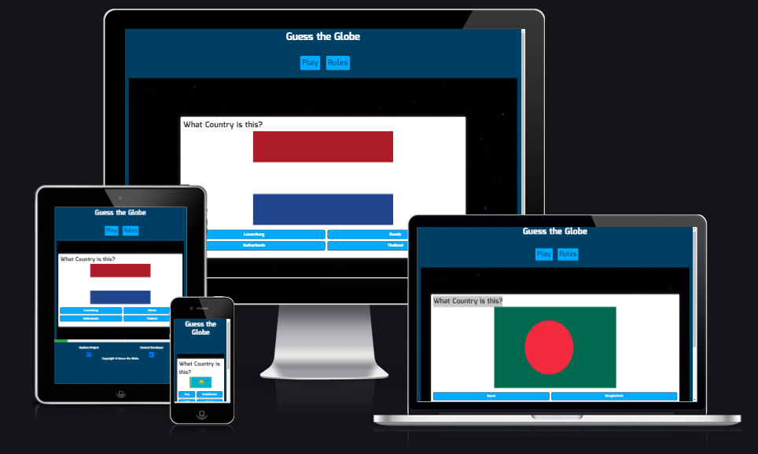

# Guess the Globe
(Developer: Keith Bautista)

[Live Website](https://keithbautista.github.io/guess-the-globe/index.html)

## Table of Contents
1. [Project Goals](#project-goals)
    1. [User Goals](#user-goals)
    2. [Site Owner Goals](#site-owner-goals)

2. [User Experience](#user-experience)
    1. [Target Audience](#target-audience)
    2. [User Requirements](#user-requirement)

3. [User Stories](#user-stories)
    1. [First Time User](#first-time-user)
    2. [Returning User](#returning-user)
    3. [Site Owner](#site-owner)

## Project Goals

### User Goals

- Ability to be able to find a quiz game.
- Ability to find a quiz game that provides its content in a clear and consise manner.
- Ability to contact the developer whom created the site.

### Site Owner Goals

- Provide a fun and exciting game that includes pictures.
- Ability for users to be able to contact with me.
- Provide an easy and simple way to see progress through a synamic progress bar.

## User Experience

### Target Audience

- People who are looking for a fun and quick game.
- People whom are interested in flags and countries

### User Requirements

- A website which is intuitive and is simple to navigate around.
- Easily find information within a couple clicks such as rules and contact information.
- Links and Buttons works as expected.
- Ability to easily get in contact with Business through the site.
- Easily access through different forms of interaction (Mobile and Desktop).

## User Stories

#### First Time User

1. As a first time user I would like to see a simple layout that is easily navigatable.
2. As a first time user I would like to know how the game works.
3. As a first time user I would like to know my current progress through the questions.

#### Returning User

4. I want to be able to play the game on any device that I choose, especially my phone.
5. I want to play the game with friends and family to compare knowledge on flags and countries.

#### Site Owner

6. As the site owner I want users to enjoy the game I have created.
7. As the site owner I want users to have the ability to get in contact with me in case further oportunities arise.
8. As the site owner I want the users to be able to easily access the site and know their current progress through the questions.
